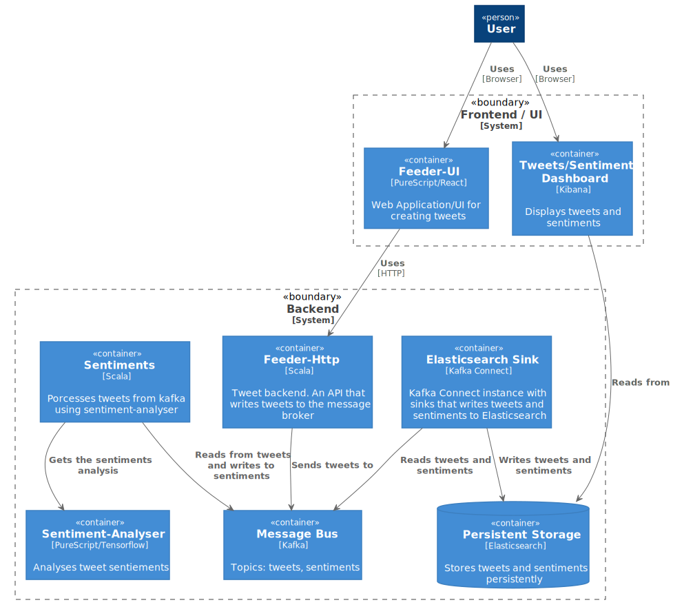
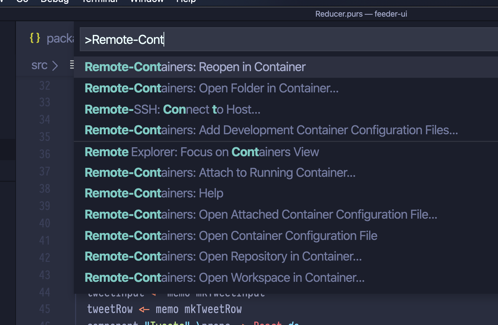
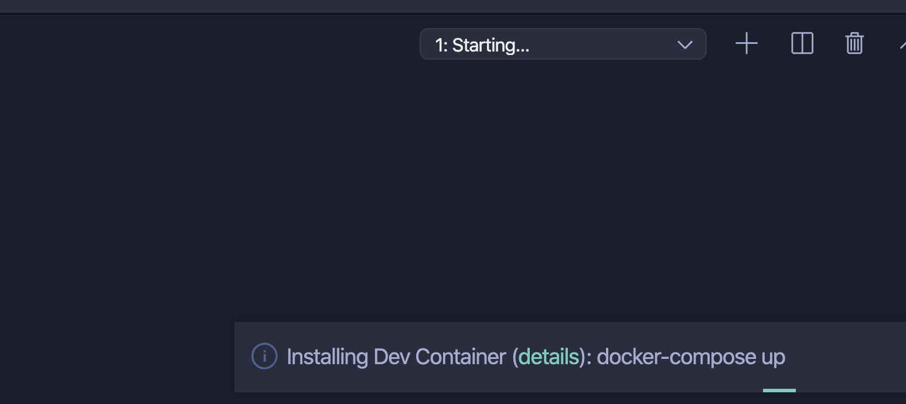
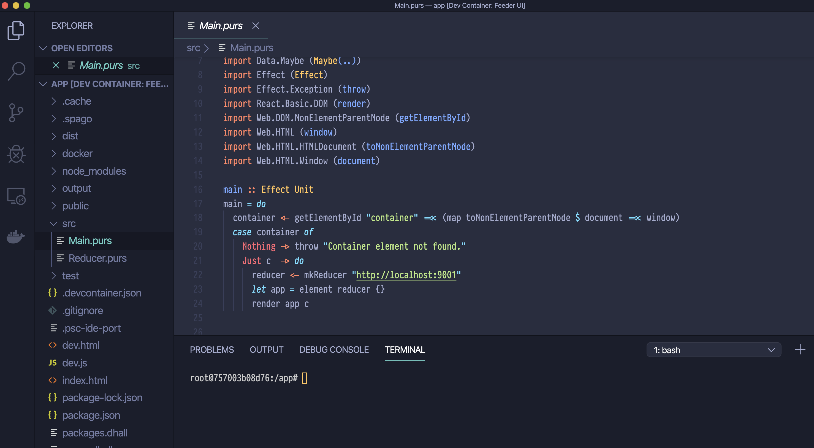
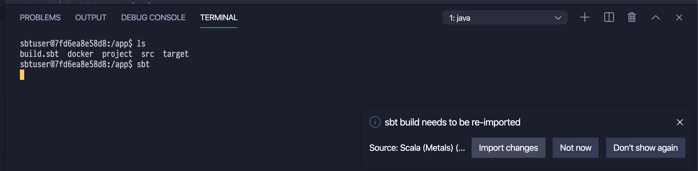

# Hivemind Microservice Workshop Exercise Material

Demo of a microservice architecture for sentiment analysis. It provides a simple ui for tweeting. Tweets are then sent for sentiment analysis (toxicity). This repo comes with batteries included, apart from docker-compose and vs code (for development) no further stuff required 😎(see [Prerequisites](#prerequisites) for more information).

## TOC

- [Overview](#overview)
- [Prerequisites](#prerequisites)
- [Running locally (non-development)](#running-locally-non-development)
- [Developing](#developing)
- [Troubleshooting](#troubleshooting)

## Overview

### Architecture



### Tech stack

| Service | Tech | Published ports |
|---------|------|-----------------|
| Feeder ui | purescript, node, react | 9000 |
| Feeder http | scala, jvm, http4s, monix | 9001 |
| Sentiments | scala, jvm, monix | 9002 |
| Sentiment analysis | purescript, node, tensorflow | 9003 |
| Elastic search | | 9200, 9300 |
| Kibana | | 5601 |
| Zookeeper | | |
| Kafka {1-3} | | | 
| Kafka-connect | | 8083 | 

## Prerequisites

### Docker

Install [Docker and docker-compose](https://docs.docker.com/get-docker/).

A couple of services will spin up, so make sure to give docker enough resources. E.g.

- CPUs: 8
- Memory: 10 GB
- Disk image size: 120 GB

### VS Code (development only)

- Install vs code <https://code.visualstudio.com/>
- Afterwards install the remote development extensions <https://marketplace.visualstudio.com/items?itemName=ms-vscode-remote.vscode-remote-extensionpack>

For development, vscode will spin up a full, containerized development environment with all necessary tools and editor plugins.

## Running locally (non-development)

```sh
docker-compose -f docker-compose.yml -f docker-compose.local.yml up
```

Now go, grab a ☕ while this is starting up...

Open the feeder ui <http://localhost:9000/> and tweet something.

### Setup Kafka Connect & Kibana

#### Kafka Connect

Run:

```sh
docker-compose exec kafka-connect sh setup.sh
```

This will create a connector between kafka topics (`feeds`, `sentiments`) and elasticsearch.

You should see the following output:

```sh
{"name":"tweets-to-es","config":{"connector.class":"io.confluent.connect.elasticsearch.ElasticsearchSinkConnector","tasks.max":"1","topics":"tweets","key.ignore":"true","topic.schema.ignore":"true","schema.ignore":"true","connection.url":"http://elasticsearch:9200","type.name":"kafka-connect","name":"tweets-to-es"},"tasks":[],"type":"sink"}{"name":"sentiments-to-es","config":{"connector.class":"io.confluent.connect.elasticsearch.ElasticsearchSinkConnector","tasks.max":"1","topics":"sentiments","key.ignore":"true","topic.schema.ignore":"true","schema.ignore":"true","connection.url":"http://elasticsearch:9200","type.name":"kafka-connect","name":"sentiments-to-es"},"tasks":[],"type":"sink"}%
```

#### Kibana

- Open the Kibana management console and browse to `Management -> Index Management -> Elasticsearch -> IndexManagement` or open this link: <http://localhost:5601/app/Kibana#/management/elasticsearch/index_management/indices?_g=()>
- You should see the indices `tweets` and `sentiments`.
- If not, check that you have set up kafka-connect correctly.
- Now we need to create the Kibana indices. On the same page, select `Kibana -> IndexManagement` or click
<http://localhost:5601/app/Kibana#/management/Kibana/index_patterns?_g=()>
- Click on `Create index pattern` with the pattern `sentiments*` and click on `Next` and `Create index pattern`.
- You can do the same for tweets.
- On the main menu select `Discover` or click http://localhost:5601/app/Kibana#/discover?_g=()
- You should now see your analysed tweets.

You can find some [examples here](https://github.com/conversationai/conversationai.github.io/blob/master/crowdsourcing_annotation_schemes/toxicity_with_subattributes.md#examples-answers-from-a-rater-to-help-calibrate-annotators).

## Developing


**Note:** If you ran the local (non-development) setup before, make sure you have properly stopped & destroyed all containers.

First, start up the 3rd party services (zookeeper, kafka, elastic, kibana):

```sh
docker-compose -f docker-compose.yml up
```

Check whether all services are up & running.
```sh
docker-compose ps
```

```
                 Name                               Command                       State                               Ports
------------------------------------------------------------------------------------------------------------------------------------------------
microservices-workshop_elasticsearch_1   /usr/local/bin/docker-entr ...   Up                      0.0.0.0:9200->9200/tcp, 0.0.0.0:9300->9300/tcp
microservices-workshop_kafka-connect_1   /etc/confluent/docker/run        Up (health: starting)   0.0.0.0:8083->8083/tcp, 9092/tcp
microservices-workshop_kafka0_1          /etc/confluent/docker/run        Up (healthy)            9092/tcp
microservices-workshop_kafka1_1          /etc/confluent/docker/run        Up (healthy)            9092/tcp
microservices-workshop_kafka2_1          /etc/confluent/docker/run        Up (healthy)            9092/tcp
microservices-workshop_kibana_1          /usr/local/bin/dumb-init - ...   Up                      0.0.0.0:5601->5601/tcp
microservices-workshop_zookeeper_1       /etc/confluent/docker/run        Up (healthy)            2181/tcp, 2888/tcp, 3888/tcp
```


### Feeder ui

Let's begin by spinning up the feeder ui dev container.

Open the folder `feeder-ui` in VS Code. 

Open the command palette (on mac `Cmd+Shift+p`) and select `Remote-Containers: Reopen in container`.



This will open the current folder inside a dev container which has node, the purescript toolchain and the purescript ide extensions pre-installed. 



This may take a couple of minutes. When finished, you should land in the dev container's terminal.



```sh
 # node_modules will be empty
ls node_modules/
# root@757003b08d76:/app# ls node_modules/   
npm install
```

Start the ui:
```sh
npm run dev  
```
This should output something like this:
``` 
> feeder-ui@1.0.0 dev /app
> spago build --watch & parcel -p 9000 dev.html

[info] Installation complete.
spago: <stdin>: hGetLine: end of file
Server running at http://localhost:9000 
⠴ Building index.js...
```
This will start the ui in dev mode with hot reload enabled. Open http://localhost:9000 to see the ui.
Any change in the code should be automatically reflected in the ui. 

**Note:** You'll need to start the other services before you can actually tweet and see the sentiment analysis.

### Feeder http

Open the folder `feeder-http` in a new VS Code window and reopen it in container, just as you did in the previous section.

Again, this will open a new dev container with java, the scala toolchain and the scala ide extension installed.

You will probably be asked by scala metals to import the changes. 



Click on `import changes`, this will give you scala support in vs code.

Start the http service:
```sh
# start sbt
sbt
# then run the service
run
```

On first time, this will take a quite few minutes as it will download all dependencies. Use this to grab another :coffee: or :tea: in the meantime.

The service should be up & running now:
```
sbt:feeder-http> run
[info] Compiling 6 Scala sources to /app/target/scala-2.13/classes ...
[info] running com.hivemindtechnologies.feeder.Main 
[ioapp-compute-0] INFO  o.h.b.c.n.NIO1SocketServerGroup - Service bound to address /0.0.0.0:9001 
[ioapp-compute-0] INFO  o.h.s.b.BlazeServerBuilder - 
  _   _   _        _ _
 | |_| |_| |_ _ __| | | ___
 | ' \  _|  _| '_ \_  _(_-<
 |_||_\__|\__| .__/ |_|/__/
             |_| 
[ioapp-compute-0] INFO  o.h.s.b.BlazeServerBuilder - http4s v0.21.0-RC2 on blaze v0.14.11 started at http://0.0.0.0:9001/ 
```

Open http://localhost:9001/api/health to verify.

### Sentiment analyser

Open the folder `sentiment-analyser` in a new VS Code window and reopen it in container, just as you did in the previous section.

```sh
# install node dependencies
npm install
# run service
npx spago run
```

Should give something like
```
[info] Build succeeded.
2020-02-05 11:27:18.433853: I tensorflow/compiler/xla/service/service.cc:168] XLA service 0x4069460 initialized for platform Host (this does not guarantee that XLA will be used). Devices:
2020-02-05 11:27:18.433902: I tensorflow/compiler/xla/service/service.cc:176]   StreamExecutor device (0): Host, Default Version
Listening on http://0.0.0.0:9003
```

### Sentiments

Open the folder `sentiments` in a new VS Code window and reopen it in container, just as you did in the previous section.

```sh
# start sbt
sbt
# run service
run
```
You should get a lot of log messages.
```
[info] Compiling 8 Scala sources to /app/target/scala-2.13/classes ...
[info] running com.hivemindtechnologies.sentiments.Main 
[INFO] [02/05/2020 11:38:36.969] [system-akka.actor.default-dispatcher-3] [SingleSourceLogic(akka://system)] [d0ca5] Starting. StageActor Actor[akka:/
/system/system/StreamSupervisor-0/$$a#-2079864740]
[system-akka.kafka.default-dispatcher-5] INFO  o.a.k.c.c.ConsumerConfig - ConsumerConfig values: 
...
```

### Testing

Post a few tweets.

Follow the instructions to [setup Kafka Connect & Kibana](#setup-kafka-connect-kibana).


## Troubleshooting

Check that you have met the [prerequisites](#prerequisites).

Check whether you don't have any other containers or services running locally that conflict with the ports. 

If the terminal in the dev container disappears, in the vs code menu click on `Terminal -> New Terminal`.

If you make any changes to the docker-compose or Dockerfiles, try rebuilding the containers when in dev mode.